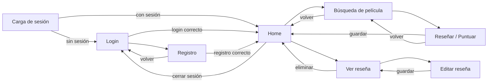
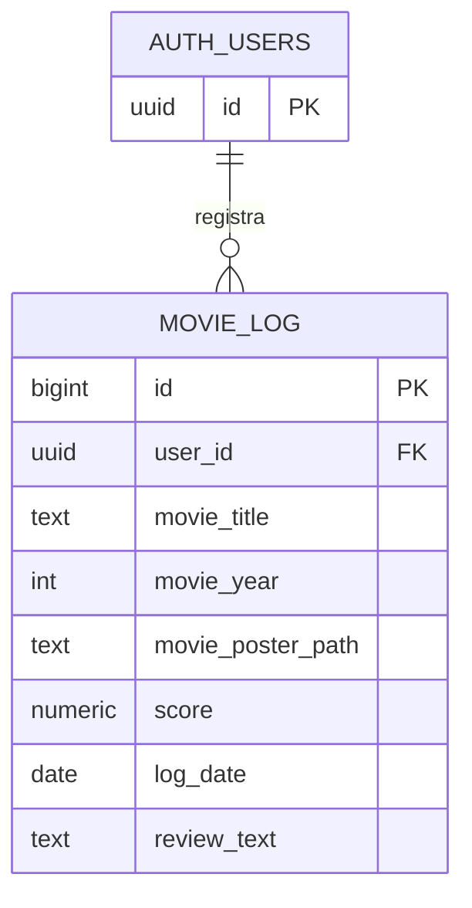

# Bitácora de Películas

Aplicación móvil multiplataforma (Android e iOS) para llevar un registro personal de las películas que viste: la puntuás, anotás la fecha y escribís tu opinión. Desarrollada con **Kotlin Multiplatform** y **Compose Multiplatform** como solución al challenge técnico de AranguriApps.

> 💡 **Cuenta de prueba inmediata:** Se provee la cuenta con correo **`prueba@prueba.com`** y contraseña **`prueba`** para probar todas las funcionalidades inmediatamente sin necesidad de registrarse.

## Tabla de contenidos

1. [De qué trata el proyecto](#1-de-qué-trata-el-proyecto)
2. [Capturas](#2-capturas)
3. [Stack tecnológico](#3-stack-tecnológico)
4. [Arquitectura](#4-arquitectura)
5. [Decisiones técnicas](#5-decisiones-técnicas)
6. [Uso de herramientas de IA](#6-uso-de-herramientas-de-ia)
7. [Cómo compilar y correr el proyecto](#7-cómo-compilar-y-correr-el-proyecto)
8. [Tests y calidad](#8-tests-y-calidad)
9. [Flujo de trabajo con Git](#9-flujo-de-trabajo-con-git)
10. [Seguridad y privacidad](#10-seguridad-y-privacidad)
11. [Limitaciones conocidas y próximos pasos](#11-limitaciones-conocidas-y-próximos-pasos)
12. [Créditos](#12-créditos)

---

## 1. De qué trata el proyecto

**Bitácora de Películas** es un diario de cine personal. Cada usuario crea una cuenta y puede:

- **Registrarse e iniciar sesión** con email y contraseña (la sesión se mantiene al cerrar la app).
- **Buscar películas** en la base de datos de TMDB escribiendo el título (la búsqueda se dispara sola cuando el usuario deja de escribir).
- **Registrar** una película: elegir la fecha en que la vio (hasta hoy), puntuarla de 0 a 10 en pasos de 0.5 y, si quiere, escribir una reseña.
- **Ver** su historial de registros, ordenado del más reciente al más antiguo.
- **Editar** y **eliminar** cualquiera de sus registros.

Cada usuario ve únicamente sus propios datos (ver [Seguridad](#10-seguridad-y-privacidad)).

### Pantallas

| # | Pantalla | Qué permite |
|---|----------|-------------|
| 1 | Login | Iniciar sesión con email y contraseña |
| 2 | Registro | Crear cuenta (email, nombre de hasta 15 caracteres, contraseña y confirmación) |
| 3 | Home | Saludo con el nombre, listado de registros del usuario, cerrar sesión y acceso a "Registrar película" |
| 4 | Búsqueda de película | Búsqueda en TMDB con portada, título, año y director |
| 5 | Reseñar / Puntuar | Fecha, puntaje con estrellas (pasos de 0.5) y reseña opcional |
| 6 | Ver reseña | Detalle del registro, con acciones de editar y eliminar (con confirmación) |
| 7 | Editar reseña | Modifica fecha, puntaje y reseña; avisa si hay cambios sin guardar |

### Navegación



---

## 2. Capturas

El proyecto cuenta con diseño responsivo, adaptación a pantallas anchas y soporte nativo para tema claro y oscuro (sin parpadeos de transición).

---

## 3. Stack tecnológico

Las versiones exactas están centralizadas en [`gradle/libs.versions.toml`](gradle/libs.versions.toml).

| Capa | Tecnología | Para qué se usa |
|------|-----------|-----------------|
| Plataforma | **Kotlin Multiplatform** | Lógica de negocio y UI compartidas entre Android e iOS |
| UI | **Compose Multiplatform** + Material 3 | UI declarativa, tema claro y oscuro propio |
| Navegación | `navigation-compose` (JetBrains) | Rutas tipadas con `@Serializable` |
| Estado | `ViewModel` + `StateFlow` (Lifecycle multiplataforma) | Estado inmutable por pantalla |
| Inyección de dependencias | **Koin** | Desacoplar dependencias y reemplazarlas en los tests |
| Red | **Ktor Client** (OkHttp en Android, Darwin en iOS) + kotlinx.serialization | Consumo de la API de TMDB |
| Backend (BaaS) | **Supabase** (`auth-kt` y `postgrest-kt`) | Autenticación y base de datos PostgreSQL |
| Imágenes | **Coil 3** (`coil-network-ktor3`) | Carga y caché de pósters |
| Fechas | `kotlinx-datetime` | Manejo de fechas multiplataforma |
| Asincronía | `kotlinx-coroutines` | Corrutinas y Flow |
| Tests | `kotlin-test`, `kotlinx-coroutines-test`, `ktor-client-mock` | 92 tests unitarios en código común |

**Servicios externos:** [Supabase](https://supabase.com) (auth + datos) y [TMDB API v3](https://developer.themoviedb.org/docs) (catálogo de películas).

---

## 4. Arquitectura

### Elección: MVVM por capas

Se eligió **MVVM** con una separación en capas liviana (`ui` → `presentation` → `domain` / `data`), sin llegar a una Clean Architecture completa.

**Por qué MVVM:**

- Es el patrón natural de Compose: la UI es una función del estado, y cada pantalla observa **un único `StateFlow` inmutable** (`UiState`).
- Separa con claridad la lógica de negocio de la vista, que es lo que pide el challenge: los composables **no contienen lógica**, solo dibujan el estado y reenvían acciones.
- El `ViewModel` es multiplataforma (Lifecycle de JetBrains), así que la lógica de presentación se comparte entre Android e iOS y es **testeable sin emulador**.

**Por qué no Clean Architecture completa:** con 7 pantallas y casos de uso triviales (en su mayoría CRUD), una capa de *use cases* por cada operación habría sumado archivos y ceremonia sin aportar claridad. Se priorizó la solidez y la legibilidad sobre la cantidad de capas. Si el dominio creciera (reglas de negocio más ricas, múltiples fuentes de datos), el siguiente paso natural sería extraer los casos de uso.

```mermaid
flowchart TB
  subgraph UI["ui — Compose Multiplatform"]
    Screens["Pantallas, componentes reutilizables y tema"]
  end
  subgraph PRES["presentation"]
    VM["ViewModel + UiState inmutable + eventos de una sola vez"]
  end
  subgraph DOMAIN["domain"]
    Rules["Validadores, errores tipados y utilidades puras"]
  end
  subgraph DATA["data"]
    Repo["Repositorios (interfaz + implementación)"]
  end
  Screens -->|"acciones del usuario"| VM
  VM -->|"StateFlow y Channel"| Screens
  VM --> Rules
  VM --> Repo
  Repo --> SB[("Supabase: Auth + Postgrest")]
  Repo --> TM[("TMDB API v3")]
  DI["Koin (DI)"] -.-> VM
  DI -.-> Repo
```



### Flujo de datos

- **Estado:** cada pantalla expone un `StateFlow<UiState>` inmutable. La UI lo recolecta con `collectAsStateWithLifecycle()`.
- **Eventos de una sola vez** (navegar, mostrar un Snackbar): se emiten por un `Channel` y se consumen una única vez. No viven en el `UiState`, para evitar que se repitan al rotar la pantalla o volver atrás.
- **Errores:** todas las llamadas de red pasan por un helper `safeCall`, que **relanza `CancellationException`** (para no romper la cancelación de corrutinas) y convierte el resto en `Result.failure`. Las excepciones se mapean a errores tipados (`AuthError`, `DataError`, `TmdbError`) con mensajes en español: nunca se muestra el mensaje crudo de una excepción.
- **Repositorios detrás de interfaces:** permiten reemplazarlos por *fakes* en los tests.

### Estructura de carpetas

```text
.
├── androidApp/                  # Punto de entrada Android (MainActivity.kt)
├── iosApp/                      # Punto de entrada iOS (ContentView.swift)
├── shared/
│   └── src/
│       ├── commonMain/kotlin/com/example/bitacoradepeliculas/
│       │   ├── App.kt           # Punto de entrada Compose y NavHost de la app
│       │   ├── config/          # AppConfig (URLs y claves de Supabase/TMDB)
│       │   ├── data/            # Repositorios, DTOs de TMDB/Supabase, safeCall y modelos
│       │   ├── domain/          # Validadores (AuthValidator), errores tipados y utilidades puras
│       │   ├── presentation/    # ViewModels, UiState y eventos por pantalla (auth, home, search, log, detail)
│       │   ├── ui/              # Vistas Compose organizadas por pantalla, componentes y tema
│       │   │   ├── auth/        # LoginScreen, RegisterScreen
│       │   │   ├── home/        # HomeScreen, MovieLogCard
│       │   │   ├── search/      # SearchMovieScreen, MovieSearchCard
│       │   │   ├── log/         # LogMovieScreen, componentes del formulario
│       │   │   ├── detail/      # MovieLogDetailScreen, EditMovieLogScreen
│       │   │   ├── components/  # Componentes reutilizables (AppTextField, AppIcons)
│       │   │   └── theme/       # Color, Type, Theme (AppTheme)
│       │   ├── navigation/      # Rutas tipadas @Serializable (Screen.kt) y AppTransitions
│       │   └── di/              # Módulos de Koin (AppModule.kt)
│       └── commonTest/          # Suite de 92 tests unitarios (data, domain, presentation, builders)
├── gradle/libs.versions.toml    # Catálogo centralizado de versiones
└── config/local.properties.example # Ejemplo de clave local TMDB
```

### Modelo de datos



---

## 5. Decisiones técnicas

| Decisión | Motivo |
|----------|--------|
| **Desnormalización controlada:** cada registro guarda título, año y ruta del póster de la película | El Home se carga con **una sola consulta** y funciona aunque TMDB falle o tarde. Evita una petición a TMDB por cada ítem de la lista. El costo es duplicar unos pocos campos de texto. El planteo ideal sería una tabla `movies` actuando como caché, escrita solo por el backend: se descartó porque complica las políticas de seguridad (RLS) y el guardado (dos escrituras que deberían ser transaccionales) para un ahorro mínimo |
| **No se guarda el ID de TMDB** | Con este alcance, título, año y póster alcanzan para todas las pantallas. Se prefirió el esquema más simple |
| **Se permiten registros duplicados de la misma película** | Ver una película más de una vez y volver a reseñarla es un caso de uso válido en una bitácora |
| **El nombre del usuario vive en `user_metadata` de Supabase Auth** | No es único y solo se usa para mostrarlo ("Bienvenido, {nombre}"). Evita una tabla de perfiles. Límite de 15 caracteres validado en la app |
| **Puntaje: 10 estrellas con medias estrellas (0 a 10 en pasos de 0.5)** | Cumple con "estrellas del 0 al 10 de 0.5 en 0.5". Se toca la mitad izquierda o derecha de una estrella o se desliza el dedo (*slide*). El componente expone semántica de accesibilidad |
| **Fechas: sin fechas futuras, y conversión explícita en UTC para el selector** | El `DatePicker` de Material 3 trabaja en milisegundos UTC; mezclarlo con la zona horaria del dispositivo produce fechas corridas un día. La conversión está aislada en funciones puras con tests. Además, la app **siempre envía la fecha** (calculada con la zona del dispositivo) y no depende del `default` del servidor, que está en UTC |
| **Reseña vacía → `NULL`** | Una reseña en blanco se guarda como `null`, no como un string vacío |
| **Hasta 10 resultados por búsqueda** | Limita las llamadas adicionales de directores y mantiene la lista ágil |
| **Sesión persistida y arranque con estado de carga** | Al abrir la app se espera el estado real de la sesión de Supabase antes de decidir entre Login y Home |
| **Posters con tamaño acotado (`w342`/`w500`)** | No se descargan imágenes más grandes de lo necesario |

---

## 6. Uso de herramientas de IA

El challenge exige usar IA como copiloto. El enfoque fue **orquestar y auditar**: la IA acelera la escritura, pero cada entrega se revisó, se compiló, se probó y se corrigió antes de integrarse.

**Herramienta:** Gemini (modo Agent).

**Uso:** Generación del código: configuración de dependencias, repositorios, ViewModels, pantallas Compose, navegación y tests. Ejecutaba los comandos de Gradle para compilar y correr los tests.

### Cómo aceleró el desarrollo

- **Agilización en la configuración:** el agente configuró el catálogo de versiones y las dependencias (Ktor, Supabase, Koin, Coil, Navigation), la inyección de dependencias y la estructura por capas, que a mano habrían llevado horas de prueba y error con las versiones.
- **Pantallas completas por iteración:** cada prompt producía ViewModel, estado, pantalla Compose, navegación y tests de una funcionalidad entera (login y registro, Home, búsqueda con debounce, formulario de registro, detalle y edición).
- **Tests y datos de prueba generados junto con el código:** fakes de repositorios, casos límite y scripts SQL de datos de ejemplo, lo que permitió validar cada pantalla apenas se terminaba.
- **Ciclo corto de corrección:** ante un error de Gradle o un comportamiento incorrecto, se le devolvía el mensaje exacto al agente y proponía el arreglo, que luego se revisaba antes de aceptarlo.

### Cómo se trabajó

1. **Un prompt por funcionalidad**, con contexto, reglas estrictas (no cambiar versiones, no inventar APIs, no commitear secretos), especificación de la pantalla tal como la pide el enunciado, criterios de validación y plan de commits.
2. **Información separada** para evitar entregas gigantes: primero datos, presentación y tests; después UI y navegación.
3. **Auditoría de cada resultado** antes de commitear: leer el código, correr `./gradlew :shared:allTests` y compilar la app, probar a mano en un dispositivo y revisar el `git diff`.
4. **Aceptar que "compila" no significa "funciona"**: cada vez que el agente informó "sin errores", se verificó el comportamiento real.
5. **Tests sobre los propios tests**: se rompió código a propósito (por ejemplo, el orden del Home o la regla del cero) para confirmar que algún test fallaba.

---

## 7. Cómo compilar y correr el proyecto

### Requisitos

- **JDK 17 o superior** (requerido por la versión de AGP del proyecto).
- **Android Studio** reciente (**2026.2.1**), con el SDK de Android instalado.

### Pasos

1. **Clonar el repositorio**

   ```bash
   git clone https://github.com/tu-usuario/BitacoraDePeliculas.git
   cd BitacoraDePeliculas
   ```

2. **Ejecución directa (Sin configuración previa):**

   > **Nota sobre la API Key de TMDB:**
   > La aplicación **ya incluye la API Key de TMDB configurada en `AppConfig.kt`** (expuesta de forma deliberada en el código fuente para facilitar la ejecución y revisión inmediata de esta prueba técnica). No es necesario solicitar ni configurar ninguna clave adicional para probar la app.
   > 
   > Si deseás utilizar tu propia clave, podés añadirla opcionalmente en el archivo `local.properties` en la raíz del proyecto (ver ejemplo en [`config/local.properties.example`](config/local.properties.example)):
   >
   > ```properties
   > TMDB_API_KEY=tu-api-key-v3-de-tmdb
   > ```

3. **Backend (Supabase):**
   > La aplicación **ya está conectada a un servidor de Supabase configurado y desplegado en la nube** (URL y clave pública en `AppConfig.kt`). No es necesario levantar ni configurar ningún servidor de Supabase local para probar la app.
   > 
   > Podés iniciar sesión inmediatamente con la cuenta de prueba:
   > - **Email:** `prueba@prueba.com`
   > - **Contraseña:** `prueba`
   > 
   > Opcionalmente, si quisieras usar tu propio proyecto de Supabase, ver la sección [Supabase propio (opcional)](#supabase-propio-opcional).

4. **Compilar e instalar en Android**

   ```bash
   # Linux / macOS
   ./gradlew :androidApp:assembleDebug
   # Windows
   .\gradlew :androidApp:assembleDebug
   ```

   El APK queda en `androidApp/build/outputs/apk/debug/`. También podés abrir el proyecto en Android Studio y ejecutar la configuración **androidApp** en un emulador o dispositivo.

5. **Correr los tests**

   ```bash
   ./gradlew :shared:allTests
   ```

   Los tests de iOS solo se ejecutan en macOS; en otros sistemas, Gradle los omite.

### APK de release

Para generar el APK de release con minificación R8 y reducción de recursos habilitadas:

```bash
./gradlew :androidApp:assembleRelease
```

El APK instalable queda generado en `androidApp/build/outputs/apk/release/`.

### Supabase propio (opcional)

1. Creá un proyecto en [Supabase](https://supabase.com).
2. En **Authentication → Providers → Email**, desactivá **Confirm email** (la app asume que, tras registrarse, el usuario queda con sesión iniciada).
3. En el **SQL Editor**, ejecutá:

   ```sql
   create table public.movie_log (
     id bigint generated always as identity primary key,
     user_id uuid not null default auth.uid () references auth.users (id) on delete cascade,
     movie_title text not null,
     movie_year int,
     movie_poster_path text,
     score numeric(3, 1) not null check (score >= 0 and score <= 10),
     log_date date not null,
     review_text text
   );

   -- Opcional: solo permitir pasos de 0.5 en el puntaje
   -- alter table public.movie_log add constraint movie_log_score_half_step
   --   check (score * 2 = trunc(score * 2));

   create index movie_log_user_date_idx on public.movie_log (user_id, log_date desc);

   alter table public.movie_log enable row level security;

   create policy "select own" on public.movie_log for select to authenticated
     using ((select auth.uid ()) = user_id);

   create policy "insert own" on public.movie_log for insert to authenticated
     with check ((select auth.uid ()) = user_id);

   create policy "update own" on public.movie_log for update to authenticated
     using ((select auth.uid ()) = user_id)
     with check ((select auth.uid ()) = user_id);

   create policy "delete own" on public.movie_log for delete to authenticated
     using ((select auth.uid ()) = user_id);
   ```

4. Copiá la **URL** y la clave **anon/publishable** (*Project Settings → API*) a `AppConfig.kt`. **Nunca** uses la clave `service_role` en la app.

---

## 8. Tests y calidad

- **92 tests unitarios** en `commonTest` (100% ejecutándose y pasando en todos los targets).
- **Qué se prueba:** validaciones (email, nombre con límite de 15 caracteres y emojis, contraseña), mapeo de errores, utilidades puras (puntaje, fechas, formato, URLs de póster), y los ViewModels de login, registro, Home, búsqueda, registrar, detalle y edición, usando *fakes* de los repositorios y tiempo virtual de corrutinas (`kotlinx-coroutines-test`).
- **Casos cubiertos:** estados de carga, vacío y error, reintentos, debounce y cancelación de búsquedas viejas, doble toque, sesión expirada, cambios sin guardar (`isDirty`) y límites de entrada.
- **Repositorios de red:** probados con `ktor-client-mock`, sin red real, verificando parseo, filtros, cuerpos de las peticiones y mapeo de errores HTTP.
- **QA manual:** se probaron a mano, en un dispositivo, el flujo completo (registro, login, búsqueda, alta, detalle, edición, eliminación y cierre de sesión), el modo avión, la rotación de pantalla y el aislamiento entre usuarios.

### Lo que no cubren los tests

La UI de Compose (se validó manualmente), la conexión real a Supabase y TMDB, y la ejecución en iOS.

---

## 9. Flujo de trabajo con Git

- **`main`** siempre estable: compila y pasa los tests.
- **Ramas cortas por funcionalidad** (`feat/auth`, `feat/home`, `feat/movie-search`, `feat/log-movie`, `feat/movie-log-detail`, `feat/edit-movie-log`, ...) integradas a `main`.
- **Commits pequeños y atómicos**, cada uno compilando por sí solo, con mensajes en formato [Conventional Commits](https://www.conventionalcommits.org/) en español.

      Ejemplo: `feat(auth): login y registro con Supabase`.

---

## 10. Seguridad y privacidad

- **Row Level Security (RLS):** la clave *publishable* de Supabase viaja dentro de la app, por lo que cualquiera podría consultar la API directamente. RLS garantiza que, aun así, **cada usuario solo pueda leer, crear, modificar y borrar sus propios registros** (`user_id = auth.uid()`). La app no filtra por usuario en el cliente: lo resuelve la base de datos.
- **Exposición deliberada de claves para evaluación:** Con el propósito exclusivo de facilitar la prueba técnica para el puesto, las claves se incluyen en `AppConfig.kt`. En un entorno profesional de producción, las claves privadas jamás deben estar en la app cliente, debiendo protegerse con un backend *proxy* o variables de entorno restringidas.
- **Sin secretos en el repositorio:** `local.properties` está ignorado por git.
- **Logs:** el cliente de TMDB está configurado para no imprimir la clave en los logs.
- **Contraseñas:** las gestiona Supabase Auth; la app nunca las almacena.
- **Límite de 15 caracteres del nombre:** se aplica en la app con control de pares suplentes. `user_metadata` no admite restricciones a nivel de base de datos, así que un cliente que llame a la API directamente podría guardar uno más largo.

---

## 11. Limitaciones conocidas y próximos pasos

- Sin soporte offline: se requiere conexión para ver y modificar los registros.
- La búsqueda muestra solo los primeros 10 resultados de TMDB (sin paginación).
- No hay una tabla de películas compartida: la información de cada película se copia en cada registro.
- Ejecución en iOS no verificada en dispositivo físico.
- Sin recuperación de contraseña dentro de la app.
- Sin integración continua configurada: los tests se ejecutan localmente con `./gradlew :shared:allTests`.

---

## 12. Créditos

- Datos y pósters de películas: **TMDB**. *Este producto usa la API de TMDB pero no está avalado ni certificado por TMDB.*

  

- Backend: [Supabase](https://supabase.com).
- Desarrollado como solución al challenge técnico **Software Engineer Mobile** de AranguriApps.
